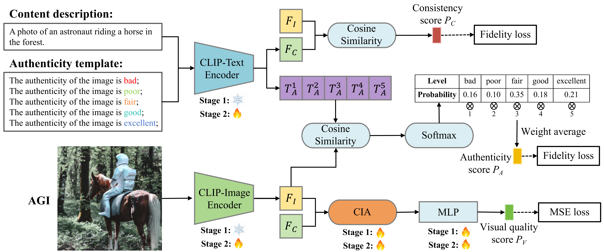

Cross-Modality Interactive Attention Network (CIA-Net)
===========================
The official repo of Cross-Modality Interactive Attention Network for AI-Generated Image Quality Assessment (PR 2025)
****
# Abstract
Recently, AI-generative techniques have revolutionized image creation, prompting the
need for AI-generated image (AGI) quality assessment. This paper introduces CIA-Net,
a Cross-modality Interactive Attention Network, for blind AGI quality evaluation. Using
a multi-task framework, CIA-Net processes text and image inputs to output consistency,
visual quality, and authenticity scores. Specifically, CIA-Net first encodes two-modal
data to obtain textual and visual embeddings. Next, for consistency score prediction, it
computes the similarity between these two kinds of embeddings in view of that text-to-image alignment. 
For visual quality prediction, it fuses textural and visual embeddings
using a well-designed cross-modality interactive attention module. For authenticity
score prediction, it constructs a textural template that contains authenticity labels and
computes the joint probability from the similarity between the textural embeddings of
each element and the visual embeddings. Experimental results show that CIA-Net is
more competent for the AGI quality assessment task than 11 state-of-the-art competing
methods. 
<div style="text-align: center;">
  
</div>

---
# ⚒️ Requirement
torch >= 1.8.0, Python == 3.7  
Before you start, run the following commands to install the environment
```
conda create -n Myenv python==3.7
conda activate Myenv
pip install -r requirements.txt
```
Download Databases
```
AGIQA3K: https://github.com/lcysyzxdxc/AGIQA-3k-Database
AIGCIQA2023: https://github.com/wangjiarui153/AIGCIQA2023
PKU-I2IQA: https://github.com/jiquan123/I2IQA
```

# Training on 10 splits
Set the **--AGIQA3K_set**, **--AGIQA3K_set**, and **--AGIQA3K_set** parameters in **MTD_IQAv6_train.py** to 
the addresses of your dataset file. Then run the following command.
```
python train.py
```

# Evaluation on test-sets
Set the **--opt** and **--datasets** parameters in **test.py** to the factor and dataset you want to 
test, and then run the following command.
```
python test.py
```

# 📒Citation
```
@article{zhou2025cross,
  title={Cross-Modality Interactive Attention Network for AI-generated image quality assessment},
  author={Zhou, Tianwei and Tan, Songbai and Li, Leida and Zhao, Baoquan and Jiang, Qiuping and Yue, Guanghui},
  journal={Pattern Recognition},
  pages={111693},
  year={2025},
  publisher={Elsevier}
}
```
